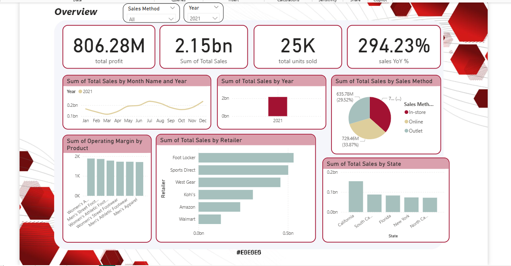
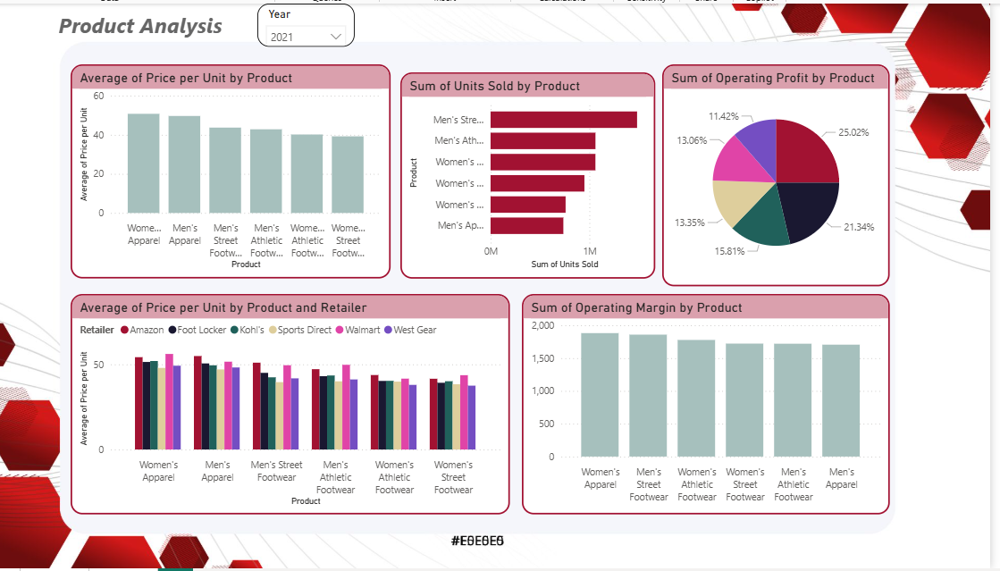
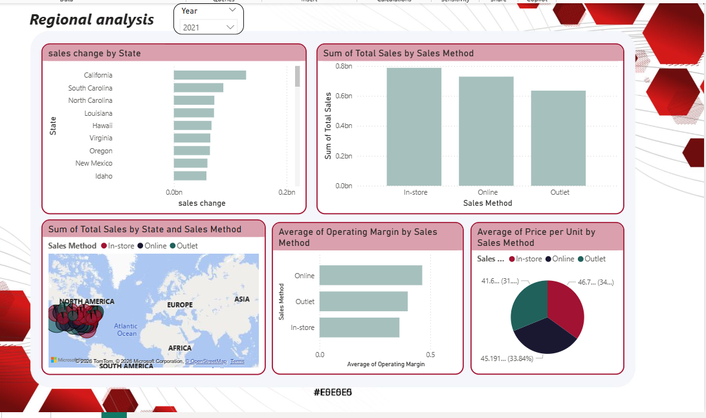

# Adidas Sales Analysis

## Project Goal
Analyze Adidas sales data to understand the main drivers behind sales growth, pricing impact, and regional performance differences.

## Business Questions
- what drove the year-over-year sales growth?
- Which products are the top contributors to total sales?
- Are there seasonal patterns affecting performance?

## Tools Used
- Power BI (Data modeling & visualization)

## Key Insights
- Sales show a noticeable decline in March and October.
- Total sales in 2021 were three times higher than in 2020, likely due to the impact of the pandemic in 2020.
- Men's Street Footwear adn Men's Athletic Footwear cotribute the highest share of total sales.
- Most profits are generated from Men's Stree Footwear and Women's Apparel, which also achieve the highest profit margins.
- Online sales are showing a steady increase over time.
- Despite the growth in online sales, the majority of total sales still come from in-store channels

## Recommendations
- Increase investment in the online sales channel for regions without physical in-store locations.
- Avoid spending additional marketing budget on products that are already top sellers.
- Men's Footwear can sustain a price increase, as market demand is high, indicating a willingness to pay more.
- Introduce special offers or promotions during low-sales months to boost revenue.

## Dashboard Preview

## Author
Marian Moawed# adidas_sales_analysis
